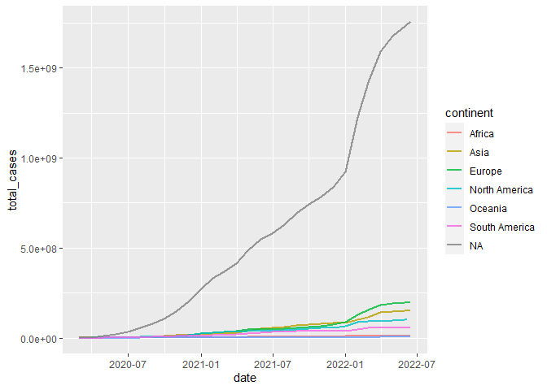
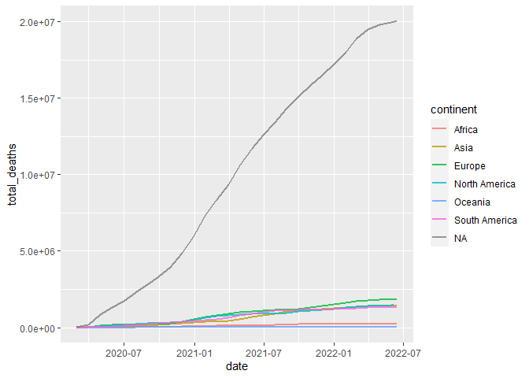
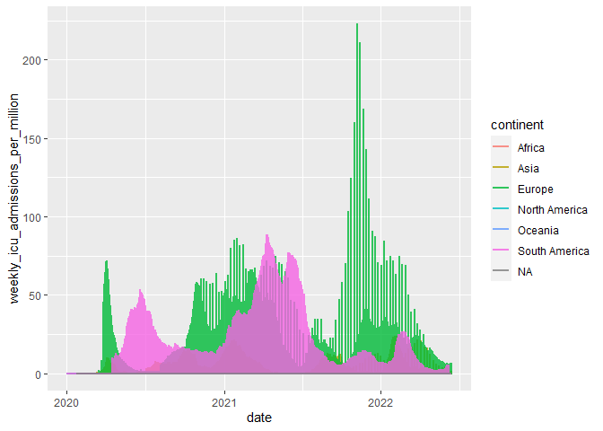

# Data Science Practical Test

``` r
#gc() # garbage collection 
library(pacman)
p_load(tidyverse, lubridate)
if(!require("tidyverse")) install.packages("tidyverse")
library(tidyverse)
library(dplyr)  
library(ggplot2)  
 
library(RColorBrewer) 
library(hrbrthemes) 
```

    ## NOTE: Either Arial Narrow or Roboto Condensed fonts are required to use these themes.

    ##       Please use hrbrthemes::import_roboto_condensed() to install Roboto Condensed and

    ##       if Arial Narrow is not on your system, please see https://bit.ly/arialnarrow

``` r
library(lubridate)  
library(xts)    
```

    ## Loading required package: zoo

    ## 
    ## Attaching package: 'zoo'

    ## The following objects are masked from 'package:base':
    ## 
    ##     as.Date, as.Date.numeric

    ## 
    ## Attaching package: 'xts'

    ## The following objects are masked from 'package:dplyr':
    ## 
    ##     first, last

``` r
list.files('C:/Users/Cabous/OneDrive/Desktop/22017542/Question1/code/', full.names = T, recursive = T) %>% as.list() %>% walk(~source(.))
```

### Question 1

#### Loading the data

``` r
Covid_19 <- Data(Datroot = "C:/Users/Cabous/OneDrive/Desktop/22017542/Question1/data/Covid/owid-covid-data.csv")
```

    ## Rows: 194260 Columns: 67
    ## -- Column specification --------------------------------------------------------
    ## Delimiter: ","
    ## chr   (4): iso_code, continent, location, tests_units
    ## dbl  (62): total_cases, new_cases, new_cases_smoothed, total_deaths, new_dea...
    ## date  (1): date
    ## 
    ## i Use `spec()` to retrieve the full column specification for this data.
    ## i Specify the column types or set `show_col_types = FALSE` to quiet this message.

#### First plot

An interesting graph would be a graph showing the total number of cases
per month, grouped by continent. We have to transform our dataset, so
that it is grouped by month and continent.

``` r
Covid_19$total_deaths[is.na(Covid_19$total_deaths)] <- 0
Covid_19$total_cases[is.na(Covid_19$total_cases)] <- 0
Covid_19$continent[Covid_19$continent==0] <- NA
Covid_19$people_fully_vaccinated_per_hundred[is.na(Covid_19$people_fully_vaccinated_per_hundred)] <- 0
Covid_19$weekly_icu_admissions_per_million[is.na(Covid_19$weekly_icu_admissions_per_million)] <- 0
```

``` r
g <- compare_3year_trend_cases(df = Covid_19, Datesel = ymd(20200101), NYears = 3)

g
```



The second plot in the paper …

``` r
g <- compare_3year_trend_deaths(df = Covid_19, Datesel = ymd(20200101), NYears = 3)

g
```

 The
second plot in the paper …

``` r
Covid_19 %>% 
    
    ggplot() + 
    
    geom_line(aes(x = date, y = weekly_icu_admissions_per_million, color = continent), alpha = 0.8, 
              size = 1)
```


``` r
Covid_19 %>% 
    
    ggplot() + 
    
    geom_line(aes(x = date, y = people_fully_vaccinated_per_hundred, color = continent), alpha = 0.8, 
              size = 1)
```



``` r
#As the majority of people became fully vaccinated around middle 2021,
#icu admissions declined sharply this led icu amissions
```

As the majority of people became fully vaccinated around middle 2021,
icu admissions declined sharply this led icu amissions

### Question 2

### First plot

Some description here would be great.

### Table

### Second plot

### Regression plot

Short overview
