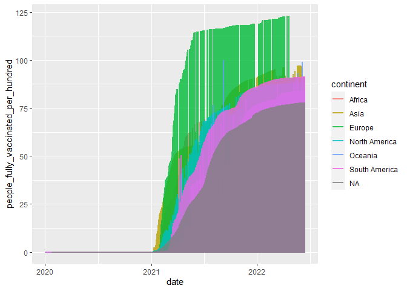

# Data Science Practical Test

``` r
#gc() # garbage collection 
library(pacman)
p_load(tidyverse, lubridate)
if(!require("tidyverse")) install.packages("tidyverse")
library(tidyverse)
library(dplyr)  
library(ggplot2)  
 
library(RColorBrewer) 
library(lubridate)  
library(xts)    
```

    ## Loading required package: zoo

    ## 
    ## Attaching package: 'zoo'

    ## The following objects are masked from 'package:base':
    ## 
    ##     as.Date, as.Date.numeric

    ## 
    ## Attaching package: 'xts'

    ## The following objects are masked from 'package:dplyr':
    ## 
    ##     first, last

``` r
list.files('C:/Users/Cabous/OneDrive/Desktop/22017542/Question1/code/', full.names = T, recursive = T) %>% as.list() %>% walk(~source(.))
```

### Question 1

#### Loading the data

``` r
Covid_19 <- Data(Datroot = "C:/Users/Cabous/OneDrive/Desktop/22017542/Question1/data/Covid/owid-covid-data.csv")
```

    ## Rows: 194260 Columns: 67
    ## -- Column specification --------------------------------------------------------
    ## Delimiter: ","
    ## chr   (4): iso_code, continent, location, tests_units
    ## dbl  (62): total_cases, new_cases, new_cases_smoothed, total_deaths, new_dea...
    ## date  (1): date
    ## 
    ## i Use `spec()` to retrieve the full column specification for this data.
    ## i Specify the column types or set `show_col_types = FALSE` to quiet this message.

#### First plot

An interesting graph would be a graph showing the total number of cases
per month, grouped by continent. We have to transform our dataset, so
that it is grouped by month and continent. However, first we have to
remove any NA values.

``` r
Covid_19$total_deaths[is.na(Covid_19$total_deaths)] <- 0
Covid_19$total_cases[is.na(Covid_19$total_cases)] <- 0
Covid_19$continent[Covid_19$continent==0] <- NA
```

Now we can plot the total number of cases for each continent. We see
that African countries have reported way fewer cases relative to other
regions, however this could be because of a lack in transparency, or
fewer covid tests.

``` r
g <- compare_3year_trend_cases(df = Covid_19, Datesel = ymd(20200101), NYears = 3)

g
```


The second plot looks at covid related deaths for each region. Again,
African countries have reported fewer deaths relative to other regions.

``` r
g <- compare_3year_trend_deaths(df = Covid_19, Datesel = ymd(20200101), NYears = 3)

g
```


The second part of Question 1 compared the relationship between weekly
ICU admissions and vaccinations. However, first removing any NA values.

``` r
Covid_19$people_fully_vaccinated_per_hundred[is.na(Covid_19$people_fully_vaccinated_per_hundred)] <- 0
Covid_19$weekly_icu_admissions_per_million[is.na(Covid_19$weekly_icu_admissions_per_million)] <- 0
```

``` r
Covid_19 %>% 
    
    ggplot() + 
    
    geom_line(aes(x = date, y = weekly_icu_admissions_per_million, color = continent), alpha = 0.8, 
              size = 1)
```


``` r
Covid_19 %>% 
    
    ggplot() + 
    
    geom_line(aes(x = date, y = people_fully_vaccinated_per_hundred, color = continent), alpha = 0.8, 
              size = 1)
```



Ignoring the clear outlier in the ICU-admissions graph (probably due to
an error in my code). As the majority of people became fully vaccinated
around middle 2021, it appears that ICU admissions declined around the
same time. This would suggest that vaccinations led to fewer ICU
admissions.

### Question 2

``` r
if(!require("tidyverse")) install.packages("tidyverse")
library(tidyverse)
library(dplyr)  
library(ggplot2) 

list.files('C:/Users/Cabous/OneDrive/Desktop/22017542/Question2/code/', full.names = T, recursive = T) %>% as.list() %>% walk(~source(.))

 # Load data
London_weather <- Data_source(Datroot = "C:/Users/Cabous/OneDrive/Desktop/22017542/Question2/data/London/london_weather.csv")
```

    ## Rows: 15341 Columns: 10
    ## -- Column specification --------------------------------------------------------
    ## Delimiter: ","
    ## dbl (10): date, cloud_cover, sunshine, global_radiation, max_temp, mean_temp...
    ## 
    ## i Use `spec()` to retrieve the full column specification for this data.
    ## i Specify the column types or set `show_col_types = FALSE` to quiet this message.

### First plot

In my analysis, the maximum temperature recorded was between 10 and 15
Celsius, which is relatively cold compared to Cape Town (mean of 20).

``` r
hist(London_weather$max_temp,breaks = 13, col = "blue", main = "Maximum temperature")
```

 \###
Second plot

According to the second plot, London only has a lot days with less than
3 hours of sunshine. Thus, in order to persuade her to stay I would
certainly mention this point.

``` r
hist(London_weather$sunshine ,breaks = 10, col = "yellow", main = "Hours of sunshine per day")
```


### Question 3

``` r
if(!require("tidyverse")) install.packages("tidyverse")
library(tidyverse)
library(data.table)
```

    ## 
    ## Attaching package: 'data.table'

    ## The following objects are masked from 'package:xts':
    ## 
    ##     first, last

    ## The following objects are masked from 'package:lubridate':
    ## 
    ##     hour, isoweek, mday, minute, month, quarter, second, wday, week,
    ##     yday, year

    ## The following objects are masked from 'package:dplyr':
    ## 
    ##     between, first, last

    ## The following object is masked from 'package:purrr':
    ## 
    ##     transpose

``` r
library(lubridate)
library(gridExtra)
```

    ## 
    ## Attaching package: 'gridExtra'

    ## The following object is masked from 'package:dplyr':
    ## 
    ##     combine

``` r
library(RColorBrewer)
library(viridis)
```

    ## Loading required package: viridisLite

``` r
library(magrittr)
```

    ## 
    ## Attaching package: 'magrittr'

    ## The following object is masked from 'package:purrr':
    ## 
    ##     set_names

    ## The following object is masked from 'package:tidyr':
    ## 
    ##     extract

``` r
 library(circlize)
```

    ## ========================================
    ## circlize version 0.4.15
    ## CRAN page: https://cran.r-project.org/package=circlize
    ## Github page: https://github.com/jokergoo/circlize
    ## Documentation: https://jokergoo.github.io/circlize_book/book/
    ## 
    ## If you use it in published research, please cite:
    ## Gu, Z. circlize implements and enhances circular visualization
    ##   in R. Bioinformatics 2014.
    ## 
    ## This message can be suppressed by:
    ##   suppressPackageStartupMessages(library(circlize))
    ## ========================================

``` r
library(cowplot)
```

    ## 
    ## Attaching package: 'cowplot'

    ## The following object is masked from 'package:lubridate':
    ## 
    ##     stamp

``` r
library(ggalt)
```

    ## Registered S3 methods overwritten by 'ggalt':
    ##   method                  from   
    ##   grid.draw.absoluteGrob  ggplot2
    ##   grobHeight.absoluteGrob ggplot2
    ##   grobWidth.absoluteGrob  ggplot2
    ##   grobX.absoluteGrob      ggplot2
    ##   grobY.absoluteGrob      ggplot2

``` r
library(fmsb)
library(ggrepel)
library(ggbump)
```

``` r
list.files('C:/Users/Cabous/OneDrive/Desktop/22017542/Question3/code/', full.names = T, recursive = T) %>% as.list() %>% walk(~source(.))
```

    ## Rows: 1304 Columns: 49
    ## -- Column specification --------------------------------------------------------
    ## Delimiter: ","
    ## chr (14): tourney_id, tourney_name, surface, tourney_level, winner_entry, wi...
    ## dbl (12): draw_size, tourney_date, match_num, winner_id, winner_seed, winner...
    ## lgl (23): minutes, w_ace, w_df, w_svpt, w_1stIn, w_1stWon, w_2ndWon, w_SvGms...
    ## 
    ## i Use `spec()` to retrieve the full column specification for this data.
    ## i Specify the column types or set `show_col_types = FALSE` to quiet this message.

    ## Warning: One or more parsing issues, see `problems()` for details

    ## Rows: 2010 Columns: 49
    ## -- Column specification --------------------------------------------------------
    ## Delimiter: ","
    ## chr (13): tourney_id, tourney_name, surface, tourney_level, winner_name, win...
    ## dbl (12): draw_size, tourney_date, match_num, winner_id, winner_seed, winner...
    ## lgl (24): winner_entry, minutes, w_ace, w_df, w_svpt, w_1stIn, w_1stWon, w_2...
    ## 
    ## i Use `spec()` to retrieve the full column specification for this data.
    ## i Specify the column types or set `show_col_types = FALSE` to quiet this message.
    ## Rows: 2582 Columns: 49
    ## -- Column specification --------------------------------------------------------
    ## Delimiter: ","
    ## chr (14): tourney_id, tourney_name, surface, tourney_level, winner_entry, wi...
    ## dbl (12): draw_size, tourney_date, match_num, winner_id, winner_seed, winner...
    ## lgl (23): minutes, w_ace, w_df, w_svpt, w_1stIn, w_1stWon, w_2ndWon, w_SvGms...
    ## 
    ## i Use `spec()` to retrieve the full column specification for this data.
    ## i Specify the column types or set `show_col_types = FALSE` to quiet this message.
    ## Rows: 3361 Columns: 49
    ## -- Column specification --------------------------------------------------------
    ## Delimiter: ","
    ## chr (14): tourney_id, tourney_name, surface, tourney_level, winner_entry, wi...
    ## dbl (12): draw_size, tourney_date, match_num, winner_id, winner_seed, winner...
    ## lgl (23): minutes, w_ace, w_df, w_svpt, w_1stIn, w_1stWon, w_2ndWon, w_SvGms...
    ## 
    ## i Use `spec()` to retrieve the full column specification for this data.
    ## i Specify the column types or set `show_col_types = FALSE` to quiet this message.
    ## Rows: 3318 Columns: 49
    ## -- Column specification --------------------------------------------------------
    ## Delimiter: ","
    ## chr (14): tourney_id, tourney_name, surface, tourney_level, winner_entry, wi...
    ## dbl (12): draw_size, tourney_date, match_num, winner_id, winner_seed, winner...
    ## lgl (23): minutes, w_ace, w_df, w_svpt, w_1stIn, w_1stWon, w_2ndWon, w_SvGms...
    ## 
    ## i Use `spec()` to retrieve the full column specification for this data.
    ## i Specify the column types or set `show_col_types = FALSE` to quiet this message.
    ## Rows: 4124 Columns: 49
    ## -- Column specification --------------------------------------------------------
    ## Delimiter: ","
    ## chr (14): tourney_id, tourney_name, surface, tourney_level, winner_entry, wi...
    ## dbl (16): draw_size, tourney_date, match_num, winner_id, winner_seed, winner...
    ## lgl (19): minutes, w_ace, w_df, w_svpt, w_1stIn, w_1stWon, w_2ndWon, w_SvGms...
    ## 
    ## i Use `spec()` to retrieve the full column specification for this data.
    ## i Specify the column types or set `show_col_types = FALSE` to quiet this message.
    ## Rows: 4183 Columns: 49
    ## -- Column specification --------------------------------------------------------
    ## Delimiter: ","
    ## chr (14): tourney_id, tourney_name, surface, tourney_level, winner_entry, wi...
    ## dbl (16): draw_size, tourney_date, match_num, winner_id, winner_seed, winner...
    ## lgl (19): minutes, w_ace, w_df, w_svpt, w_1stIn, w_1stWon, w_2ndWon, w_SvGms...
    ## 
    ## i Use `spec()` to retrieve the full column specification for this data.
    ## i Specify the column types or set `show_col_types = FALSE` to quiet this message.
    ## Rows: 4163 Columns: 49
    ## -- Column specification --------------------------------------------------------
    ## Delimiter: ","
    ## chr (14): tourney_id, tourney_name, surface, tourney_level, winner_entry, wi...
    ## dbl (16): draw_size, tourney_date, match_num, winner_id, winner_seed, winner...
    ## lgl (19): minutes, w_ace, w_df, w_svpt, w_1stIn, w_1stWon, w_2ndWon, w_SvGms...
    ## 
    ## i Use `spec()` to retrieve the full column specification for this data.
    ## i Specify the column types or set `show_col_types = FALSE` to quiet this message.
    ## Rows: 3976 Columns: 49
    ## -- Column specification --------------------------------------------------------
    ## Delimiter: ","
    ## chr (14): tourney_id, tourney_name, surface, tourney_level, winner_entry, wi...
    ## dbl (16): draw_size, tourney_date, match_num, winner_id, winner_seed, winner...
    ## lgl (19): minutes, w_ace, w_df, w_svpt, w_1stIn, w_1stWon, w_2ndWon, w_SvGms...
    ## 
    ## i Use `spec()` to retrieve the full column specification for this data.
    ## i Specify the column types or set `show_col_types = FALSE` to quiet this message.
    ## Rows: 4137 Columns: 49
    ## -- Column specification --------------------------------------------------------
    ## Delimiter: ","
    ## chr (14): tourney_id, tourney_name, surface, tourney_level, winner_entry, wi...
    ## dbl (14): draw_size, tourney_date, match_num, winner_id, winner_seed, winner...
    ## lgl (21): minutes, w_ace, w_df, w_svpt, w_1stIn, w_1stWon, w_2ndWon, w_SvGms...
    ## 
    ## i Use `spec()` to retrieve the full column specification for this data.
    ## i Specify the column types or set `show_col_types = FALSE` to quiet this message.
    ## Rows: 3899 Columns: 49
    ## -- Column specification --------------------------------------------------------
    ## Delimiter: ","
    ## chr (14): tourney_id, tourney_name, surface, tourney_level, winner_entry, wi...
    ## dbl (16): draw_size, tourney_date, match_num, winner_id, winner_seed, winner...
    ## lgl (19): minutes, w_ace, w_df, w_svpt, w_1stIn, w_1stWon, w_2ndWon, w_SvGms...
    ## 
    ## i Use `spec()` to retrieve the full column specification for this data.
    ## i Specify the column types or set `show_col_types = FALSE` to quiet this message.
    ## Rows: 3959 Columns: 49
    ## -- Column specification --------------------------------------------------------
    ## Delimiter: ","
    ## chr (14): tourney_id, tourney_name, surface, tourney_level, winner_entry, wi...
    ## dbl (16): draw_size, tourney_date, match_num, winner_id, winner_seed, winner...
    ## lgl (19): minutes, w_ace, w_df, w_svpt, w_1stIn, w_1stWon, w_2ndWon, w_SvGms...
    ## 
    ## i Use `spec()` to retrieve the full column specification for this data.
    ## i Specify the column types or set `show_col_types = FALSE` to quiet this message.
    ## Rows: 4046 Columns: 49
    ## -- Column specification --------------------------------------------------------
    ## Delimiter: ","
    ## chr (14): tourney_id, tourney_name, surface, tourney_level, winner_entry, wi...
    ## dbl (14): draw_size, tourney_date, match_num, winner_id, winner_seed, winner...
    ## lgl (21): minutes, w_ace, w_df, w_svpt, w_1stIn, w_1stWon, w_2ndWon, w_SvGms...
    ## 
    ## i Use `spec()` to retrieve the full column specification for this data.
    ## i Specify the column types or set `show_col_types = FALSE` to quiet this message.
    ## Rows: 3893 Columns: 49
    ## -- Column specification --------------------------------------------------------
    ## Delimiter: ","
    ## chr (14): tourney_id, tourney_name, surface, tourney_level, winner_entry, wi...
    ## dbl (14): draw_size, tourney_date, match_num, winner_id, winner_seed, winner...
    ## lgl (21): minutes, w_ace, w_df, w_svpt, w_1stIn, w_1stWon, w_2ndWon, w_SvGms...
    ## 
    ## i Use `spec()` to retrieve the full column specification for this data.
    ## i Specify the column types or set `show_col_types = FALSE` to quiet this message.
    ## Rows: 4070 Columns: 49
    ## -- Column specification --------------------------------------------------------
    ## Delimiter: ","
    ## chr (14): tourney_id, tourney_name, surface, tourney_level, winner_entry, wi...
    ## dbl (14): draw_size, tourney_date, match_num, winner_id, winner_seed, winner...
    ## lgl (21): minutes, w_ace, w_df, w_svpt, w_1stIn, w_1stWon, w_2ndWon, w_SvGms...
    ## 
    ## i Use `spec()` to retrieve the full column specification for this data.
    ## i Specify the column types or set `show_col_types = FALSE` to quiet this message.
    ## Rows: 3489 Columns: 49
    ## -- Column specification --------------------------------------------------------
    ## Delimiter: ","
    ## chr (14): tourney_id, tourney_name, surface, tourney_level, winner_entry, wi...
    ## dbl (14): draw_size, tourney_date, match_num, winner_id, winner_seed, winner...
    ## lgl (21): minutes, w_ace, w_df, w_svpt, w_1stIn, w_1stWon, w_2ndWon, w_SvGms...
    ## 
    ## i Use `spec()` to retrieve the full column specification for this data.
    ## i Specify the column types or set `show_col_types = FALSE` to quiet this message.
    ## Rows: 3248 Columns: 49
    ## -- Column specification --------------------------------------------------------
    ## Delimiter: ","
    ## chr (14): tourney_id, tourney_name, surface, tourney_level, winner_entry, wi...
    ## dbl (14): draw_size, tourney_date, match_num, winner_id, winner_seed, winner...
    ## lgl (21): minutes, w_ace, w_df, w_svpt, w_1stIn, w_1stWon, w_2ndWon, w_SvGms...
    ## 
    ## i Use `spec()` to retrieve the full column specification for this data.
    ## i Specify the column types or set `show_col_types = FALSE` to quiet this message.
    ## Rows: 3391 Columns: 49
    ## -- Column specification --------------------------------------------------------
    ## Delimiter: ","
    ## chr (14): tourney_id, tourney_name, surface, tourney_level, winner_entry, wi...
    ## dbl (14): draw_size, tourney_date, match_num, winner_id, winner_seed, winner...
    ## lgl (21): minutes, w_ace, w_df, w_svpt, w_1stIn, w_1stWon, w_2ndWon, w_SvGms...
    ## 
    ## i Use `spec()` to retrieve the full column specification for this data.
    ## i Specify the column types or set `show_col_types = FALSE` to quiet this message.
    ## Rows: 3249 Columns: 49
    ## -- Column specification --------------------------------------------------------
    ## Delimiter: ","
    ## chr (14): tourney_id, tourney_name, surface, tourney_level, winner_entry, wi...
    ## dbl (14): draw_size, tourney_date, match_num, winner_id, winner_seed, winner...
    ## lgl (21): minutes, w_ace, w_df, w_svpt, w_1stIn, w_1stWon, w_2ndWon, w_SvGms...
    ## 
    ## i Use `spec()` to retrieve the full column specification for this data.
    ## i Specify the column types or set `show_col_types = FALSE` to quiet this message.
    ## Rows: 3546 Columns: 49
    ## -- Column specification --------------------------------------------------------
    ## Delimiter: ","
    ## chr (14): tourney_id, tourney_name, surface, tourney_level, winner_entry, wi...
    ## dbl (14): draw_size, tourney_date, match_num, winner_id, winner_seed, winner...
    ## lgl (21): minutes, w_ace, w_df, w_svpt, w_1stIn, w_1stWon, w_2ndWon, w_SvGms...
    ## 
    ## i Use `spec()` to retrieve the full column specification for this data.
    ## i Specify the column types or set `show_col_types = FALSE` to quiet this message.
    ## Rows: 3733 Columns: 49
    ## -- Column specification --------------------------------------------------------
    ## Delimiter: ","
    ## chr (14): tourney_id, tourney_name, surface, tourney_level, winner_entry, wi...
    ## dbl (14): draw_size, tourney_date, match_num, winner_id, winner_seed, winner...
    ## lgl (21): minutes, w_ace, w_df, w_svpt, w_1stIn, w_1stWon, w_2ndWon, w_SvGms...
    ## 
    ## i Use `spec()` to retrieve the full column specification for this data.
    ## i Specify the column types or set `show_col_types = FALSE` to quiet this message.
    ## Rows: 3583 Columns: 49
    ## -- Column specification --------------------------------------------------------
    ## Delimiter: ","
    ## chr (14): tourney_id, tourney_name, surface, tourney_level, winner_entry, wi...
    ## dbl (14): draw_size, tourney_date, match_num, winner_id, winner_seed, winner...
    ## lgl (21): minutes, w_ace, w_df, w_svpt, w_1stIn, w_1stWon, w_2ndWon, w_SvGms...
    ## 
    ## i Use `spec()` to retrieve the full column specification for this data.
    ## i Specify the column types or set `show_col_types = FALSE` to quiet this message.
    ## Rows: 3681 Columns: 49
    ## -- Column specification --------------------------------------------------------
    ## Delimiter: ","
    ## chr (14): tourney_id, tourney_name, surface, tourney_level, winner_entry, wi...
    ## dbl (16): draw_size, tourney_date, match_num, winner_id, winner_seed, winner...
    ## lgl (19): minutes, w_ace, w_df, w_svpt, w_1stIn, w_1stWon, w_2ndWon, w_SvGms...
    ## 
    ## i Use `spec()` to retrieve the full column specification for this data.
    ## i Specify the column types or set `show_col_types = FALSE` to quiet this message.
    ## Rows: 3727 Columns: 49
    ## -- Column specification --------------------------------------------------------
    ## Delimiter: ","
    ## chr (14): tourney_id, tourney_name, surface, tourney_level, winner_entry, wi...
    ## dbl (35): draw_size, tourney_date, match_num, winner_id, winner_seed, winner...
    ## 
    ## i Use `spec()` to retrieve the full column specification for this data.
    ## i Specify the column types or set `show_col_types = FALSE` to quiet this message.
    ## Rows: 3792 Columns: 49
    ## -- Column specification --------------------------------------------------------
    ## Delimiter: ","
    ## chr (14): tourney_id, tourney_name, surface, tourney_level, winner_entry, wi...
    ## dbl (35): draw_size, tourney_date, match_num, winner_id, winner_seed, winner...
    ## 
    ## i Use `spec()` to retrieve the full column specification for this data.
    ## i Specify the column types or set `show_col_types = FALSE` to quiet this message.
    ## Rows: 3890 Columns: 49
    ## -- Column specification --------------------------------------------------------
    ## Delimiter: ","
    ## chr (14): tourney_id, tourney_name, surface, tourney_level, winner_entry, wi...
    ## dbl (35): draw_size, tourney_date, match_num, winner_id, winner_seed, winner...
    ## 
    ## i Use `spec()` to retrieve the full column specification for this data.
    ## i Specify the column types or set `show_col_types = FALSE` to quiet this message.
    ## Rows: 3938 Columns: 49
    ## -- Column specification --------------------------------------------------------
    ## Delimiter: ","
    ## chr (14): tourney_id, tourney_name, surface, tourney_level, winner_entry, wi...
    ## dbl (35): draw_size, tourney_date, match_num, winner_id, winner_seed, winner...
    ## 
    ## i Use `spec()` to retrieve the full column specification for this data.
    ## i Specify the column types or set `show_col_types = FALSE` to quiet this message.
    ## Rows: 3800 Columns: 49
    ## -- Column specification --------------------------------------------------------
    ## Delimiter: ","
    ## chr (14): tourney_id, tourney_name, surface, tourney_level, winner_entry, wi...
    ## dbl (35): draw_size, tourney_date, match_num, winner_id, winner_seed, winner...
    ## 
    ## i Use `spec()` to retrieve the full column specification for this data.
    ## i Specify the column types or set `show_col_types = FALSE` to quiet this message.
    ## Rows: 3771 Columns: 49
    ## -- Column specification --------------------------------------------------------
    ## Delimiter: ","
    ## chr (14): tourney_id, tourney_name, surface, tourney_level, winner_entry, wi...
    ## dbl (35): draw_size, tourney_date, match_num, winner_id, winner_seed, winner...
    ## 
    ## i Use `spec()` to retrieve the full column specification for this data.
    ## i Specify the column types or set `show_col_types = FALSE` to quiet this message.
    ## Rows: 3623 Columns: 49
    ## -- Column specification --------------------------------------------------------
    ## Delimiter: ","
    ## chr (14): tourney_id, tourney_name, surface, tourney_level, winner_entry, wi...
    ## dbl (35): draw_size, tourney_date, match_num, winner_id, winner_seed, winner...
    ## 
    ## i Use `spec()` to retrieve the full column specification for this data.
    ## i Specify the column types or set `show_col_types = FALSE` to quiet this message.
    ## Rows: 3591 Columns: 49
    ## -- Column specification --------------------------------------------------------
    ## Delimiter: ","
    ## chr (14): tourney_id, tourney_name, surface, tourney_level, winner_entry, wi...
    ## dbl (35): draw_size, tourney_date, match_num, winner_id, winner_seed, winner...
    ## 
    ## i Use `spec()` to retrieve the full column specification for this data.
    ## i Specify the column types or set `show_col_types = FALSE` to quiet this message.
    ## Rows: 3334 Columns: 49
    ## -- Column specification --------------------------------------------------------
    ## Delimiter: ","
    ## chr (14): tourney_id, tourney_name, surface, tourney_level, winner_entry, wi...
    ## dbl (35): draw_size, tourney_date, match_num, winner_id, winner_seed, winner...
    ## 
    ## i Use `spec()` to retrieve the full column specification for this data.
    ## i Specify the column types or set `show_col_types = FALSE` to quiet this message.
    ## Rows: 3378 Columns: 49
    ## -- Column specification --------------------------------------------------------
    ## Delimiter: ","
    ## chr (14): tourney_id, tourney_name, surface, tourney_level, winner_entry, wi...
    ## dbl (35): draw_size, tourney_date, match_num, winner_id, winner_seed, winner...
    ## 
    ## i Use `spec()` to retrieve the full column specification for this data.
    ## i Specify the column types or set `show_col_types = FALSE` to quiet this message.
    ## Rows: 3307 Columns: 49
    ## -- Column specification --------------------------------------------------------
    ## Delimiter: ","
    ## chr (14): tourney_id, tourney_name, surface, tourney_level, winner_entry, wi...
    ## dbl (35): draw_size, tourney_date, match_num, winner_id, winner_seed, winner...
    ## 
    ## i Use `spec()` to retrieve the full column specification for this data.
    ## i Specify the column types or set `show_col_types = FALSE` to quiet this message.
    ## Rows: 3213 Columns: 49
    ## -- Column specification --------------------------------------------------------
    ## Delimiter: ","
    ## chr (14): tourney_id, tourney_name, surface, tourney_level, winner_entry, wi...
    ## dbl (35): draw_size, tourney_date, match_num, winner_id, winner_seed, winner...
    ## 
    ## i Use `spec()` to retrieve the full column specification for this data.
    ## i Specify the column types or set `show_col_types = FALSE` to quiet this message.
    ## Rows: 3218 Columns: 49
    ## -- Column specification --------------------------------------------------------
    ## Delimiter: ","
    ## chr (14): tourney_id, tourney_name, surface, tourney_level, winner_entry, wi...
    ## dbl (35): draw_size, tourney_date, match_num, winner_id, winner_seed, winner...
    ## 
    ## i Use `spec()` to retrieve the full column specification for this data.
    ## i Specify the column types or set `show_col_types = FALSE` to quiet this message.
    ## Rows: 3288 Columns: 49
    ## -- Column specification --------------------------------------------------------
    ## Delimiter: ","
    ## chr (14): tourney_id, tourney_name, surface, tourney_level, winner_entry, wi...
    ## dbl (35): draw_size, tourney_date, match_num, winner_id, winner_seed, winner...
    ## 
    ## i Use `spec()` to retrieve the full column specification for this data.
    ## i Specify the column types or set `show_col_types = FALSE` to quiet this message.
    ## Rows: 3263 Columns: 49
    ## -- Column specification --------------------------------------------------------
    ## Delimiter: ","
    ## chr (14): tourney_id, tourney_name, surface, tourney_level, winner_entry, wi...
    ## dbl (35): draw_size, tourney_date, match_num, winner_id, winner_seed, winner...
    ## 
    ## i Use `spec()` to retrieve the full column specification for this data.
    ## i Specify the column types or set `show_col_types = FALSE` to quiet this message.
    ## Rows: 3267 Columns: 49
    ## -- Column specification --------------------------------------------------------
    ## Delimiter: ","
    ## chr (14): tourney_id, tourney_name, surface, tourney_level, winner_entry, wi...
    ## dbl (35): draw_size, tourney_date, match_num, winner_id, winner_seed, winner...
    ## 
    ## i Use `spec()` to retrieve the full column specification for this data.
    ## i Specify the column types or set `show_col_types = FALSE` to quiet this message.
    ## Rows: 3192 Columns: 49
    ## -- Column specification --------------------------------------------------------
    ## Delimiter: ","
    ## chr (14): tourney_id, tourney_name, surface, tourney_level, winner_entry, wi...
    ## dbl (35): draw_size, tourney_date, match_num, winner_id, winner_seed, winner...
    ## 
    ## i Use `spec()` to retrieve the full column specification for this data.
    ## i Specify the column types or set `show_col_types = FALSE` to quiet this message.
    ## Rows: 3123 Columns: 49
    ## -- Column specification --------------------------------------------------------
    ## Delimiter: ","
    ## chr (14): tourney_id, tourney_name, surface, tourney_level, winner_entry, wi...
    ## dbl (35): draw_size, tourney_date, match_num, winner_id, winner_seed, winner...
    ## 
    ## i Use `spec()` to retrieve the full column specification for this data.
    ## i Specify the column types or set `show_col_types = FALSE` to quiet this message.
    ## Rows: 3085 Columns: 49
    ## -- Column specification --------------------------------------------------------
    ## Delimiter: ","
    ## chr (14): tourney_id, tourney_name, surface, tourney_level, winner_entry, wi...
    ## dbl (35): draw_size, tourney_date, match_num, winner_id, winner_seed, winner...
    ## 
    ## i Use `spec()` to retrieve the full column specification for this data.
    ## i Specify the column types or set `show_col_types = FALSE` to quiet this message.
    ## Rows: 3030 Columns: 49
    ## -- Column specification --------------------------------------------------------
    ## Delimiter: ","
    ## chr (14): tourney_id, tourney_name, surface, tourney_level, winner_entry, wi...
    ## dbl (35): draw_size, tourney_date, match_num, winner_id, winner_seed, winner...
    ## 
    ## i Use `spec()` to retrieve the full column specification for this data.
    ## i Specify the column types or set `show_col_types = FALSE` to quiet this message.
    ## Rows: 3015 Columns: 49
    ## -- Column specification --------------------------------------------------------
    ## Delimiter: ","
    ## chr (14): tourney_id, tourney_name, surface, tourney_level, winner_entry, wi...
    ## dbl (35): draw_size, tourney_date, match_num, winner_id, winner_seed, winner...
    ## 
    ## i Use `spec()` to retrieve the full column specification for this data.
    ## i Specify the column types or set `show_col_types = FALSE` to quiet this message.
    ## Rows: 3010 Columns: 49
    ## -- Column specification --------------------------------------------------------
    ## Delimiter: ","
    ## chr (14): tourney_id, tourney_name, surface, tourney_level, winner_entry, wi...
    ## dbl (35): draw_size, tourney_date, match_num, winner_id, winner_seed, winner...
    ## 
    ## i Use `spec()` to retrieve the full column specification for this data.
    ## i Specify the column types or set `show_col_types = FALSE` to quiet this message.
    ## Rows: 2944 Columns: 49
    ## -- Column specification --------------------------------------------------------
    ## Delimiter: ","
    ## chr (14): tourney_id, tourney_name, surface, tourney_level, winner_entry, wi...
    ## dbl (35): draw_size, tourney_date, match_num, winner_id, winner_seed, winner...
    ## 
    ## i Use `spec()` to retrieve the full column specification for this data.
    ## i Specify the column types or set `show_col_types = FALSE` to quiet this message.
    ## Rows: 2901 Columns: 49
    ## -- Column specification --------------------------------------------------------
    ## Delimiter: ","
    ## chr (14): tourney_id, tourney_name, surface, tourney_level, winner_entry, wi...
    ## dbl (35): draw_size, tourney_date, match_num, winner_id, winner_seed, winner...
    ## 
    ## i Use `spec()` to retrieve the full column specification for this data.
    ## i Specify the column types or set `show_col_types = FALSE` to quiet this message.
    ## Rows: 2943 Columns: 49
    ## -- Column specification --------------------------------------------------------
    ## Delimiter: ","
    ## chr (14): tourney_id, tourney_name, surface, tourney_level, winner_entry, wi...
    ## dbl (35): draw_size, tourney_date, match_num, winner_id, winner_seed, winner...
    ## 
    ## i Use `spec()` to retrieve the full column specification for this data.
    ## i Specify the column types or set `show_col_types = FALSE` to quiet this message.
    ## Rows: 2941 Columns: 49
    ## -- Column specification --------------------------------------------------------
    ## Delimiter: ","
    ## chr (14): tourney_id, tourney_name, surface, tourney_level, winner_entry, wi...
    ## dbl (35): draw_size, tourney_date, match_num, winner_id, winner_seed, winner...
    ## 
    ## i Use `spec()` to retrieve the full column specification for this data.
    ## i Specify the column types or set `show_col_types = FALSE` to quiet this message.
    ## Rows: 2902 Columns: 49
    ## -- Column specification --------------------------------------------------------
    ## Delimiter: ","
    ## chr (14): tourney_id, tourney_name, surface, tourney_level, winner_entry, wi...
    ## dbl (35): draw_size, tourney_date, match_num, winner_id, winner_seed, winner...
    ## 
    ## i Use `spec()` to retrieve the full column specification for this data.
    ## i Specify the column types or set `show_col_types = FALSE` to quiet this message.
    ## Rows: 2889 Columns: 49
    ## -- Column specification --------------------------------------------------------
    ## Delimiter: ","
    ## chr (14): tourney_id, tourney_name, surface, tourney_level, winner_entry, wi...
    ## dbl (35): draw_size, tourney_date, match_num, winner_id, winner_seed, winner...
    ## 
    ## i Use `spec()` to retrieve the full column specification for this data.
    ## i Specify the column types or set `show_col_types = FALSE` to quiet this message.
    ## Rows: 2796 Columns: 49
    ## -- Column specification --------------------------------------------------------
    ## Delimiter: ","
    ## chr (14): tourney_id, tourney_name, surface, tourney_level, winner_entry, wi...
    ## dbl (35): draw_size, tourney_date, match_num, winner_id, winner_seed, winner...
    ## 
    ## i Use `spec()` to retrieve the full column specification for this data.
    ## i Specify the column types or set `show_col_types = FALSE` to quiet this message.
    ## Rows: 1462 Columns: 49
    ## -- Column specification --------------------------------------------------------
    ## Delimiter: ","
    ## chr (14): tourney_id, tourney_name, surface, tourney_level, winner_entry, wi...
    ## dbl (35): draw_size, tourney_date, match_num, winner_id, winner_seed, winner...
    ## 
    ## i Use `spec()` to retrieve the full column specification for this data.
    ## i Specify the column types or set `show_col_types = FALSE` to quiet this message.
    ## Rows: 20726 Columns: 4
    ## -- Column specification --------------------------------------------------------
    ## Delimiter: ","
    ## dbl (3): ranking_date, rank, player
    ## lgl (1): points
    ## 
    ## i Use `spec()` to retrieve the full column specification for this data.
    ## i Specify the column types or set `show_col_types = FALSE` to quiet this message.
    ## Rows: 284809 Columns: 4
    ## -- Column specification --------------------------------------------------------
    ## Delimiter: ","
    ## dbl (3): ranking_date, rank, player
    ## lgl (1): points
    ## 
    ## i Use `spec()` to retrieve the full column specification for this data.
    ## i Specify the column types or set `show_col_types = FALSE` to quiet this message.
    ## Rows: 725606 Columns: 4
    ## -- Column specification --------------------------------------------------------
    ## Delimiter: ","
    ## dbl (4): ranking_date, rank, player, points
    ## 
    ## i Use `spec()` to retrieve the full column specification for this data.
    ## i Specify the column types or set `show_col_types = FALSE` to quiet this message.
    ## Rows: 920907 Columns: 4
    ## -- Column specification --------------------------------------------------------
    ## Delimiter: ","
    ## dbl (4): ranking_date, rank, player, points
    ## 
    ## i Use `spec()` to retrieve the full column specification for this data.
    ## i Specify the column types or set `show_col_types = FALSE` to quiet this message.
    ## Rows: 915618 Columns: 4
    ## -- Column specification --------------------------------------------------------
    ## Delimiter: ","
    ## dbl (4): ranking_date, rank, player, points
    ## 
    ## i Use `spec()` to retrieve the full column specification for this data.
    ## i Specify the column types or set `show_col_types = FALSE` to quiet this message.
    ## Rows: 43830 Columns: 4
    ## -- Column specification --------------------------------------------------------
    ## Delimiter: ","
    ## chr (4): ranking_date, rank, player, points
    ## 
    ## i Use `spec()` to retrieve the full column specification for this data.
    ## i Specify the column types or set `show_col_types = FALSE` to quiet this message.
    ## Rows: 55729 Columns: 8
    ## -- Column specification --------------------------------------------------------
    ## Delimiter: ","
    ## chr (8): player_id, first_name, last_name, hand, birth_date, country_code, X...
    ## 
    ## i Use `spec()` to retrieve the full column specification for this data.
    ## i Specify the column types or set `show_col_types = FALSE` to quiet this message.

## Loading Data

For some reason I had some trouble loading in the data from the files
provided. Thus, I imported the data from Jeff Sackmann’s Github.

``` r
## Import Match Data

data <- read_csv('https://raw.githubusercontent.com/JeffSackmann/tennis_atp/master/atp_matches_1968.csv')
```

    ## Rows: 1304 Columns: 49
    ## -- Column specification --------------------------------------------------------
    ## Delimiter: ","
    ## chr (14): tourney_id, tourney_name, surface, tourney_level, winner_entry, wi...
    ## dbl (12): draw_size, tourney_date, match_num, winner_id, winner_seed, winner...
    ## lgl (23): minutes, w_ace, w_df, w_svpt, w_1stIn, w_1stWon, w_2ndWon, w_SvGms...
    ## 
    ## i Use `spec()` to retrieve the full column specification for this data.
    ## i Specify the column types or set `show_col_types = FALSE` to quiet this message.

``` r
for (i in 1969:2020) {
    data <- rbind(data,
                  read_csv(paste('https://raw.githubusercontent.com/JeffSackmann/tennis_atp/master/atp_matches_', i,'.csv', sep = '')))
}
```

    ## Warning: One or more parsing issues, see `problems()` for details

    ## Rows: 2010 Columns: 49
    ## -- Column specification --------------------------------------------------------
    ## Delimiter: ","
    ## chr (13): tourney_id, tourney_name, surface, tourney_level, winner_name, win...
    ## dbl (12): draw_size, tourney_date, match_num, winner_id, winner_seed, winner...
    ## lgl (24): winner_entry, minutes, w_ace, w_df, w_svpt, w_1stIn, w_1stWon, w_2...
    ## 
    ## i Use `spec()` to retrieve the full column specification for this data.
    ## i Specify the column types or set `show_col_types = FALSE` to quiet this message.
    ## Rows: 2582 Columns: 49
    ## -- Column specification --------------------------------------------------------
    ## Delimiter: ","
    ## chr (14): tourney_id, tourney_name, surface, tourney_level, winner_entry, wi...
    ## dbl (12): draw_size, tourney_date, match_num, winner_id, winner_seed, winner...
    ## lgl (23): minutes, w_ace, w_df, w_svpt, w_1stIn, w_1stWon, w_2ndWon, w_SvGms...
    ## 
    ## i Use `spec()` to retrieve the full column specification for this data.
    ## i Specify the column types or set `show_col_types = FALSE` to quiet this message.
    ## Rows: 3361 Columns: 49
    ## -- Column specification --------------------------------------------------------
    ## Delimiter: ","
    ## chr (14): tourney_id, tourney_name, surface, tourney_level, winner_entry, wi...
    ## dbl (12): draw_size, tourney_date, match_num, winner_id, winner_seed, winner...
    ## lgl (23): minutes, w_ace, w_df, w_svpt, w_1stIn, w_1stWon, w_2ndWon, w_SvGms...
    ## 
    ## i Use `spec()` to retrieve the full column specification for this data.
    ## i Specify the column types or set `show_col_types = FALSE` to quiet this message.
    ## Rows: 3318 Columns: 49
    ## -- Column specification --------------------------------------------------------
    ## Delimiter: ","
    ## chr (14): tourney_id, tourney_name, surface, tourney_level, winner_entry, wi...
    ## dbl (12): draw_size, tourney_date, match_num, winner_id, winner_seed, winner...
    ## lgl (23): minutes, w_ace, w_df, w_svpt, w_1stIn, w_1stWon, w_2ndWon, w_SvGms...
    ## 
    ## i Use `spec()` to retrieve the full column specification for this data.
    ## i Specify the column types or set `show_col_types = FALSE` to quiet this message.
    ## Rows: 4124 Columns: 49
    ## -- Column specification --------------------------------------------------------
    ## Delimiter: ","
    ## chr (14): tourney_id, tourney_name, surface, tourney_level, winner_entry, wi...
    ## dbl (16): draw_size, tourney_date, match_num, winner_id, winner_seed, winner...
    ## lgl (19): minutes, w_ace, w_df, w_svpt, w_1stIn, w_1stWon, w_2ndWon, w_SvGms...
    ## 
    ## i Use `spec()` to retrieve the full column specification for this data.
    ## i Specify the column types or set `show_col_types = FALSE` to quiet this message.
    ## Rows: 4183 Columns: 49
    ## -- Column specification --------------------------------------------------------
    ## Delimiter: ","
    ## chr (14): tourney_id, tourney_name, surface, tourney_level, winner_entry, wi...
    ## dbl (16): draw_size, tourney_date, match_num, winner_id, winner_seed, winner...
    ## lgl (19): minutes, w_ace, w_df, w_svpt, w_1stIn, w_1stWon, w_2ndWon, w_SvGms...
    ## 
    ## i Use `spec()` to retrieve the full column specification for this data.
    ## i Specify the column types or set `show_col_types = FALSE` to quiet this message.
    ## Rows: 4163 Columns: 49
    ## -- Column specification --------------------------------------------------------
    ## Delimiter: ","
    ## chr (14): tourney_id, tourney_name, surface, tourney_level, winner_entry, wi...
    ## dbl (16): draw_size, tourney_date, match_num, winner_id, winner_seed, winner...
    ## lgl (19): minutes, w_ace, w_df, w_svpt, w_1stIn, w_1stWon, w_2ndWon, w_SvGms...
    ## 
    ## i Use `spec()` to retrieve the full column specification for this data.
    ## i Specify the column types or set `show_col_types = FALSE` to quiet this message.
    ## Rows: 3976 Columns: 49
    ## -- Column specification --------------------------------------------------------
    ## Delimiter: ","
    ## chr (14): tourney_id, tourney_name, surface, tourney_level, winner_entry, wi...
    ## dbl (16): draw_size, tourney_date, match_num, winner_id, winner_seed, winner...
    ## lgl (19): minutes, w_ace, w_df, w_svpt, w_1stIn, w_1stWon, w_2ndWon, w_SvGms...
    ## 
    ## i Use `spec()` to retrieve the full column specification for this data.
    ## i Specify the column types or set `show_col_types = FALSE` to quiet this message.
    ## Rows: 4137 Columns: 49
    ## -- Column specification --------------------------------------------------------
    ## Delimiter: ","
    ## chr (14): tourney_id, tourney_name, surface, tourney_level, winner_entry, wi...
    ## dbl (14): draw_size, tourney_date, match_num, winner_id, winner_seed, winner...
    ## lgl (21): minutes, w_ace, w_df, w_svpt, w_1stIn, w_1stWon, w_2ndWon, w_SvGms...
    ## 
    ## i Use `spec()` to retrieve the full column specification for this data.
    ## i Specify the column types or set `show_col_types = FALSE` to quiet this message.
    ## Rows: 3899 Columns: 49
    ## -- Column specification --------------------------------------------------------
    ## Delimiter: ","
    ## chr (14): tourney_id, tourney_name, surface, tourney_level, winner_entry, wi...
    ## dbl (16): draw_size, tourney_date, match_num, winner_id, winner_seed, winner...
    ## lgl (19): minutes, w_ace, w_df, w_svpt, w_1stIn, w_1stWon, w_2ndWon, w_SvGms...
    ## 
    ## i Use `spec()` to retrieve the full column specification for this data.
    ## i Specify the column types or set `show_col_types = FALSE` to quiet this message.
    ## Rows: 3959 Columns: 49
    ## -- Column specification --------------------------------------------------------
    ## Delimiter: ","
    ## chr (14): tourney_id, tourney_name, surface, tourney_level, winner_entry, wi...
    ## dbl (16): draw_size, tourney_date, match_num, winner_id, winner_seed, winner...
    ## lgl (19): minutes, w_ace, w_df, w_svpt, w_1stIn, w_1stWon, w_2ndWon, w_SvGms...
    ## 
    ## i Use `spec()` to retrieve the full column specification for this data.
    ## i Specify the column types or set `show_col_types = FALSE` to quiet this message.
    ## Rows: 4046 Columns: 49
    ## -- Column specification --------------------------------------------------------
    ## Delimiter: ","
    ## chr (14): tourney_id, tourney_name, surface, tourney_level, winner_entry, wi...
    ## dbl (14): draw_size, tourney_date, match_num, winner_id, winner_seed, winner...
    ## lgl (21): minutes, w_ace, w_df, w_svpt, w_1stIn, w_1stWon, w_2ndWon, w_SvGms...
    ## 
    ## i Use `spec()` to retrieve the full column specification for this data.
    ## i Specify the column types or set `show_col_types = FALSE` to quiet this message.
    ## Rows: 3893 Columns: 49
    ## -- Column specification --------------------------------------------------------
    ## Delimiter: ","
    ## chr (14): tourney_id, tourney_name, surface, tourney_level, winner_entry, wi...
    ## dbl (14): draw_size, tourney_date, match_num, winner_id, winner_seed, winner...
    ## lgl (21): minutes, w_ace, w_df, w_svpt, w_1stIn, w_1stWon, w_2ndWon, w_SvGms...
    ## 
    ## i Use `spec()` to retrieve the full column specification for this data.
    ## i Specify the column types or set `show_col_types = FALSE` to quiet this message.
    ## Rows: 4070 Columns: 49
    ## -- Column specification --------------------------------------------------------
    ## Delimiter: ","
    ## chr (14): tourney_id, tourney_name, surface, tourney_level, winner_entry, wi...
    ## dbl (14): draw_size, tourney_date, match_num, winner_id, winner_seed, winner...
    ## lgl (21): minutes, w_ace, w_df, w_svpt, w_1stIn, w_1stWon, w_2ndWon, w_SvGms...
    ## 
    ## i Use `spec()` to retrieve the full column specification for this data.
    ## i Specify the column types or set `show_col_types = FALSE` to quiet this message.
    ## Rows: 3489 Columns: 49
    ## -- Column specification --------------------------------------------------------
    ## Delimiter: ","
    ## chr (14): tourney_id, tourney_name, surface, tourney_level, winner_entry, wi...
    ## dbl (14): draw_size, tourney_date, match_num, winner_id, winner_seed, winner...
    ## lgl (21): minutes, w_ace, w_df, w_svpt, w_1stIn, w_1stWon, w_2ndWon, w_SvGms...
    ## 
    ## i Use `spec()` to retrieve the full column specification for this data.
    ## i Specify the column types or set `show_col_types = FALSE` to quiet this message.
    ## Rows: 3248 Columns: 49
    ## -- Column specification --------------------------------------------------------
    ## Delimiter: ","
    ## chr (14): tourney_id, tourney_name, surface, tourney_level, winner_entry, wi...
    ## dbl (14): draw_size, tourney_date, match_num, winner_id, winner_seed, winner...
    ## lgl (21): minutes, w_ace, w_df, w_svpt, w_1stIn, w_1stWon, w_2ndWon, w_SvGms...
    ## 
    ## i Use `spec()` to retrieve the full column specification for this data.
    ## i Specify the column types or set `show_col_types = FALSE` to quiet this message.
    ## Rows: 3391 Columns: 49
    ## -- Column specification --------------------------------------------------------
    ## Delimiter: ","
    ## chr (14): tourney_id, tourney_name, surface, tourney_level, winner_entry, wi...
    ## dbl (14): draw_size, tourney_date, match_num, winner_id, winner_seed, winner...
    ## lgl (21): minutes, w_ace, w_df, w_svpt, w_1stIn, w_1stWon, w_2ndWon, w_SvGms...
    ## 
    ## i Use `spec()` to retrieve the full column specification for this data.
    ## i Specify the column types or set `show_col_types = FALSE` to quiet this message.
    ## Rows: 3249 Columns: 49
    ## -- Column specification --------------------------------------------------------
    ## Delimiter: ","
    ## chr (14): tourney_id, tourney_name, surface, tourney_level, winner_entry, wi...
    ## dbl (14): draw_size, tourney_date, match_num, winner_id, winner_seed, winner...
    ## lgl (21): minutes, w_ace, w_df, w_svpt, w_1stIn, w_1stWon, w_2ndWon, w_SvGms...
    ## 
    ## i Use `spec()` to retrieve the full column specification for this data.
    ## i Specify the column types or set `show_col_types = FALSE` to quiet this message.
    ## Rows: 3546 Columns: 49
    ## -- Column specification --------------------------------------------------------
    ## Delimiter: ","
    ## chr (14): tourney_id, tourney_name, surface, tourney_level, winner_entry, wi...
    ## dbl (14): draw_size, tourney_date, match_num, winner_id, winner_seed, winner...
    ## lgl (21): minutes, w_ace, w_df, w_svpt, w_1stIn, w_1stWon, w_2ndWon, w_SvGms...
    ## 
    ## i Use `spec()` to retrieve the full column specification for this data.
    ## i Specify the column types or set `show_col_types = FALSE` to quiet this message.
    ## Rows: 3733 Columns: 49
    ## -- Column specification --------------------------------------------------------
    ## Delimiter: ","
    ## chr (14): tourney_id, tourney_name, surface, tourney_level, winner_entry, wi...
    ## dbl (14): draw_size, tourney_date, match_num, winner_id, winner_seed, winner...
    ## lgl (21): minutes, w_ace, w_df, w_svpt, w_1stIn, w_1stWon, w_2ndWon, w_SvGms...
    ## 
    ## i Use `spec()` to retrieve the full column specification for this data.
    ## i Specify the column types or set `show_col_types = FALSE` to quiet this message.
    ## Rows: 3583 Columns: 49
    ## -- Column specification --------------------------------------------------------
    ## Delimiter: ","
    ## chr (14): tourney_id, tourney_name, surface, tourney_level, winner_entry, wi...
    ## dbl (14): draw_size, tourney_date, match_num, winner_id, winner_seed, winner...
    ## lgl (21): minutes, w_ace, w_df, w_svpt, w_1stIn, w_1stWon, w_2ndWon, w_SvGms...
    ## 
    ## i Use `spec()` to retrieve the full column specification for this data.
    ## i Specify the column types or set `show_col_types = FALSE` to quiet this message.
    ## Rows: 3681 Columns: 49
    ## -- Column specification --------------------------------------------------------
    ## Delimiter: ","
    ## chr (14): tourney_id, tourney_name, surface, tourney_level, winner_entry, wi...
    ## dbl (16): draw_size, tourney_date, match_num, winner_id, winner_seed, winner...
    ## lgl (19): minutes, w_ace, w_df, w_svpt, w_1stIn, w_1stWon, w_2ndWon, w_SvGms...
    ## 
    ## i Use `spec()` to retrieve the full column specification for this data.
    ## i Specify the column types or set `show_col_types = FALSE` to quiet this message.
    ## Rows: 3727 Columns: 49
    ## -- Column specification --------------------------------------------------------
    ## Delimiter: ","
    ## chr (14): tourney_id, tourney_name, surface, tourney_level, winner_entry, wi...
    ## dbl (35): draw_size, tourney_date, match_num, winner_id, winner_seed, winner...
    ## 
    ## i Use `spec()` to retrieve the full column specification for this data.
    ## i Specify the column types or set `show_col_types = FALSE` to quiet this message.
    ## Rows: 3792 Columns: 49
    ## -- Column specification --------------------------------------------------------
    ## Delimiter: ","
    ## chr (14): tourney_id, tourney_name, surface, tourney_level, winner_entry, wi...
    ## dbl (35): draw_size, tourney_date, match_num, winner_id, winner_seed, winner...
    ## 
    ## i Use `spec()` to retrieve the full column specification for this data.
    ## i Specify the column types or set `show_col_types = FALSE` to quiet this message.
    ## Rows: 3890 Columns: 49
    ## -- Column specification --------------------------------------------------------
    ## Delimiter: ","
    ## chr (14): tourney_id, tourney_name, surface, tourney_level, winner_entry, wi...
    ## dbl (35): draw_size, tourney_date, match_num, winner_id, winner_seed, winner...
    ## 
    ## i Use `spec()` to retrieve the full column specification for this data.
    ## i Specify the column types or set `show_col_types = FALSE` to quiet this message.
    ## Rows: 3938 Columns: 49
    ## -- Column specification --------------------------------------------------------
    ## Delimiter: ","
    ## chr (14): tourney_id, tourney_name, surface, tourney_level, winner_entry, wi...
    ## dbl (35): draw_size, tourney_date, match_num, winner_id, winner_seed, winner...
    ## 
    ## i Use `spec()` to retrieve the full column specification for this data.
    ## i Specify the column types or set `show_col_types = FALSE` to quiet this message.
    ## Rows: 3800 Columns: 49
    ## -- Column specification --------------------------------------------------------
    ## Delimiter: ","
    ## chr (14): tourney_id, tourney_name, surface, tourney_level, winner_entry, wi...
    ## dbl (35): draw_size, tourney_date, match_num, winner_id, winner_seed, winner...
    ## 
    ## i Use `spec()` to retrieve the full column specification for this data.
    ## i Specify the column types or set `show_col_types = FALSE` to quiet this message.
    ## Rows: 3771 Columns: 49
    ## -- Column specification --------------------------------------------------------
    ## Delimiter: ","
    ## chr (14): tourney_id, tourney_name, surface, tourney_level, winner_entry, wi...
    ## dbl (35): draw_size, tourney_date, match_num, winner_id, winner_seed, winner...
    ## 
    ## i Use `spec()` to retrieve the full column specification for this data.
    ## i Specify the column types or set `show_col_types = FALSE` to quiet this message.
    ## Rows: 3623 Columns: 49
    ## -- Column specification --------------------------------------------------------
    ## Delimiter: ","
    ## chr (14): tourney_id, tourney_name, surface, tourney_level, winner_entry, wi...
    ## dbl (35): draw_size, tourney_date, match_num, winner_id, winner_seed, winner...
    ## 
    ## i Use `spec()` to retrieve the full column specification for this data.
    ## i Specify the column types or set `show_col_types = FALSE` to quiet this message.
    ## Rows: 3591 Columns: 49
    ## -- Column specification --------------------------------------------------------
    ## Delimiter: ","
    ## chr (14): tourney_id, tourney_name, surface, tourney_level, winner_entry, wi...
    ## dbl (35): draw_size, tourney_date, match_num, winner_id, winner_seed, winner...
    ## 
    ## i Use `spec()` to retrieve the full column specification for this data.
    ## i Specify the column types or set `show_col_types = FALSE` to quiet this message.
    ## Rows: 3334 Columns: 49
    ## -- Column specification --------------------------------------------------------
    ## Delimiter: ","
    ## chr (14): tourney_id, tourney_name, surface, tourney_level, winner_entry, wi...
    ## dbl (35): draw_size, tourney_date, match_num, winner_id, winner_seed, winner...
    ## 
    ## i Use `spec()` to retrieve the full column specification for this data.
    ## i Specify the column types or set `show_col_types = FALSE` to quiet this message.
    ## Rows: 3378 Columns: 49
    ## -- Column specification --------------------------------------------------------
    ## Delimiter: ","
    ## chr (14): tourney_id, tourney_name, surface, tourney_level, winner_entry, wi...
    ## dbl (35): draw_size, tourney_date, match_num, winner_id, winner_seed, winner...
    ## 
    ## i Use `spec()` to retrieve the full column specification for this data.
    ## i Specify the column types or set `show_col_types = FALSE` to quiet this message.
    ## Rows: 3307 Columns: 49
    ## -- Column specification --------------------------------------------------------
    ## Delimiter: ","
    ## chr (14): tourney_id, tourney_name, surface, tourney_level, winner_entry, wi...
    ## dbl (35): draw_size, tourney_date, match_num, winner_id, winner_seed, winner...
    ## 
    ## i Use `spec()` to retrieve the full column specification for this data.
    ## i Specify the column types or set `show_col_types = FALSE` to quiet this message.
    ## Rows: 3213 Columns: 49
    ## -- Column specification --------------------------------------------------------
    ## Delimiter: ","
    ## chr (14): tourney_id, tourney_name, surface, tourney_level, winner_entry, wi...
    ## dbl (35): draw_size, tourney_date, match_num, winner_id, winner_seed, winner...
    ## 
    ## i Use `spec()` to retrieve the full column specification for this data.
    ## i Specify the column types or set `show_col_types = FALSE` to quiet this message.
    ## Rows: 3218 Columns: 49
    ## -- Column specification --------------------------------------------------------
    ## Delimiter: ","
    ## chr (14): tourney_id, tourney_name, surface, tourney_level, winner_entry, wi...
    ## dbl (35): draw_size, tourney_date, match_num, winner_id, winner_seed, winner...
    ## 
    ## i Use `spec()` to retrieve the full column specification for this data.
    ## i Specify the column types or set `show_col_types = FALSE` to quiet this message.
    ## Rows: 3288 Columns: 49
    ## -- Column specification --------------------------------------------------------
    ## Delimiter: ","
    ## chr (14): tourney_id, tourney_name, surface, tourney_level, winner_entry, wi...
    ## dbl (35): draw_size, tourney_date, match_num, winner_id, winner_seed, winner...
    ## 
    ## i Use `spec()` to retrieve the full column specification for this data.
    ## i Specify the column types or set `show_col_types = FALSE` to quiet this message.
    ## Rows: 3263 Columns: 49
    ## -- Column specification --------------------------------------------------------
    ## Delimiter: ","
    ## chr (14): tourney_id, tourney_name, surface, tourney_level, winner_entry, wi...
    ## dbl (35): draw_size, tourney_date, match_num, winner_id, winner_seed, winner...
    ## 
    ## i Use `spec()` to retrieve the full column specification for this data.
    ## i Specify the column types or set `show_col_types = FALSE` to quiet this message.
    ## Rows: 3267 Columns: 49
    ## -- Column specification --------------------------------------------------------
    ## Delimiter: ","
    ## chr (14): tourney_id, tourney_name, surface, tourney_level, winner_entry, wi...
    ## dbl (35): draw_size, tourney_date, match_num, winner_id, winner_seed, winner...
    ## 
    ## i Use `spec()` to retrieve the full column specification for this data.
    ## i Specify the column types or set `show_col_types = FALSE` to quiet this message.
    ## Rows: 3192 Columns: 49
    ## -- Column specification --------------------------------------------------------
    ## Delimiter: ","
    ## chr (14): tourney_id, tourney_name, surface, tourney_level, winner_entry, wi...
    ## dbl (35): draw_size, tourney_date, match_num, winner_id, winner_seed, winner...
    ## 
    ## i Use `spec()` to retrieve the full column specification for this data.
    ## i Specify the column types or set `show_col_types = FALSE` to quiet this message.
    ## Rows: 3123 Columns: 49
    ## -- Column specification --------------------------------------------------------
    ## Delimiter: ","
    ## chr (14): tourney_id, tourney_name, surface, tourney_level, winner_entry, wi...
    ## dbl (35): draw_size, tourney_date, match_num, winner_id, winner_seed, winner...
    ## 
    ## i Use `spec()` to retrieve the full column specification for this data.
    ## i Specify the column types or set `show_col_types = FALSE` to quiet this message.
    ## Rows: 3085 Columns: 49
    ## -- Column specification --------------------------------------------------------
    ## Delimiter: ","
    ## chr (14): tourney_id, tourney_name, surface, tourney_level, winner_entry, wi...
    ## dbl (35): draw_size, tourney_date, match_num, winner_id, winner_seed, winner...
    ## 
    ## i Use `spec()` to retrieve the full column specification for this data.
    ## i Specify the column types or set `show_col_types = FALSE` to quiet this message.
    ## Rows: 3030 Columns: 49
    ## -- Column specification --------------------------------------------------------
    ## Delimiter: ","
    ## chr (14): tourney_id, tourney_name, surface, tourney_level, winner_entry, wi...
    ## dbl (35): draw_size, tourney_date, match_num, winner_id, winner_seed, winner...
    ## 
    ## i Use `spec()` to retrieve the full column specification for this data.
    ## i Specify the column types or set `show_col_types = FALSE` to quiet this message.
    ## Rows: 3015 Columns: 49
    ## -- Column specification --------------------------------------------------------
    ## Delimiter: ","
    ## chr (14): tourney_id, tourney_name, surface, tourney_level, winner_entry, wi...
    ## dbl (35): draw_size, tourney_date, match_num, winner_id, winner_seed, winner...
    ## 
    ## i Use `spec()` to retrieve the full column specification for this data.
    ## i Specify the column types or set `show_col_types = FALSE` to quiet this message.
    ## Rows: 3010 Columns: 49
    ## -- Column specification --------------------------------------------------------
    ## Delimiter: ","
    ## chr (14): tourney_id, tourney_name, surface, tourney_level, winner_entry, wi...
    ## dbl (35): draw_size, tourney_date, match_num, winner_id, winner_seed, winner...
    ## 
    ## i Use `spec()` to retrieve the full column specification for this data.
    ## i Specify the column types or set `show_col_types = FALSE` to quiet this message.
    ## Rows: 2944 Columns: 49
    ## -- Column specification --------------------------------------------------------
    ## Delimiter: ","
    ## chr (14): tourney_id, tourney_name, surface, tourney_level, winner_entry, wi...
    ## dbl (35): draw_size, tourney_date, match_num, winner_id, winner_seed, winner...
    ## 
    ## i Use `spec()` to retrieve the full column specification for this data.
    ## i Specify the column types or set `show_col_types = FALSE` to quiet this message.
    ## Rows: 2901 Columns: 49
    ## -- Column specification --------------------------------------------------------
    ## Delimiter: ","
    ## chr (14): tourney_id, tourney_name, surface, tourney_level, winner_entry, wi...
    ## dbl (35): draw_size, tourney_date, match_num, winner_id, winner_seed, winner...
    ## 
    ## i Use `spec()` to retrieve the full column specification for this data.
    ## i Specify the column types or set `show_col_types = FALSE` to quiet this message.
    ## Rows: 2943 Columns: 49
    ## -- Column specification --------------------------------------------------------
    ## Delimiter: ","
    ## chr (14): tourney_id, tourney_name, surface, tourney_level, winner_entry, wi...
    ## dbl (35): draw_size, tourney_date, match_num, winner_id, winner_seed, winner...
    ## 
    ## i Use `spec()` to retrieve the full column specification for this data.
    ## i Specify the column types or set `show_col_types = FALSE` to quiet this message.
    ## Rows: 2941 Columns: 49
    ## -- Column specification --------------------------------------------------------
    ## Delimiter: ","
    ## chr (14): tourney_id, tourney_name, surface, tourney_level, winner_entry, wi...
    ## dbl (35): draw_size, tourney_date, match_num, winner_id, winner_seed, winner...
    ## 
    ## i Use `spec()` to retrieve the full column specification for this data.
    ## i Specify the column types or set `show_col_types = FALSE` to quiet this message.
    ## Rows: 2902 Columns: 49
    ## -- Column specification --------------------------------------------------------
    ## Delimiter: ","
    ## chr (14): tourney_id, tourney_name, surface, tourney_level, winner_entry, wi...
    ## dbl (35): draw_size, tourney_date, match_num, winner_id, winner_seed, winner...
    ## 
    ## i Use `spec()` to retrieve the full column specification for this data.
    ## i Specify the column types or set `show_col_types = FALSE` to quiet this message.
    ## Rows: 2889 Columns: 49
    ## -- Column specification --------------------------------------------------------
    ## Delimiter: ","
    ## chr (14): tourney_id, tourney_name, surface, tourney_level, winner_entry, wi...
    ## dbl (35): draw_size, tourney_date, match_num, winner_id, winner_seed, winner...
    ## 
    ## i Use `spec()` to retrieve the full column specification for this data.
    ## i Specify the column types or set `show_col_types = FALSE` to quiet this message.
    ## Rows: 2796 Columns: 49
    ## -- Column specification --------------------------------------------------------
    ## Delimiter: ","
    ## chr (14): tourney_id, tourney_name, surface, tourney_level, winner_entry, wi...
    ## dbl (35): draw_size, tourney_date, match_num, winner_id, winner_seed, winner...
    ## 
    ## i Use `spec()` to retrieve the full column specification for this data.
    ## i Specify the column types or set `show_col_types = FALSE` to quiet this message.
    ## Rows: 1462 Columns: 49
    ## -- Column specification --------------------------------------------------------
    ## Delimiter: ","
    ## chr (14): tourney_id, tourney_name, surface, tourney_level, winner_entry, wi...
    ## dbl (35): draw_size, tourney_date, match_num, winner_id, winner_seed, winner...
    ## 
    ## i Use `spec()` to retrieve the full column specification for this data.
    ## i Specify the column types or set `show_col_types = FALSE` to quiet this message.

``` r
## Import Rankings Data

rankings <- read_csv('https://raw.githubusercontent.com/JeffSackmann/tennis_atp/master/atp_rankings_70s.csv')
```

    ## Rows: 20726 Columns: 4
    ## -- Column specification --------------------------------------------------------
    ## Delimiter: ","
    ## dbl (3): ranking_date, rank, player
    ## lgl (1): points
    ## 
    ## i Use `spec()` to retrieve the full column specification for this data.
    ## i Specify the column types or set `show_col_types = FALSE` to quiet this message.

``` r
rankings_80s <- read_csv('https://raw.githubusercontent.com/JeffSackmann/tennis_atp/master/atp_rankings_80s.csv')
```

    ## Rows: 284809 Columns: 4
    ## -- Column specification --------------------------------------------------------
    ## Delimiter: ","
    ## dbl (3): ranking_date, rank, player
    ## lgl (1): points
    ## 
    ## i Use `spec()` to retrieve the full column specification for this data.
    ## i Specify the column types or set `show_col_types = FALSE` to quiet this message.

``` r
rankings_90s <- read_csv('https://raw.githubusercontent.com/JeffSackmann/tennis_atp/master/atp_rankings_90s.csv')
```

    ## Rows: 725606 Columns: 4
    ## -- Column specification --------------------------------------------------------
    ## Delimiter: ","
    ## dbl (4): ranking_date, rank, player, points
    ## 
    ## i Use `spec()` to retrieve the full column specification for this data.
    ## i Specify the column types or set `show_col_types = FALSE` to quiet this message.

``` r
rankings_00s <- read_csv('https://raw.githubusercontent.com/JeffSackmann/tennis_atp/master/atp_rankings_00s.csv')
```

    ## Rows: 920907 Columns: 4
    ## -- Column specification --------------------------------------------------------
    ## Delimiter: ","
    ## dbl (4): ranking_date, rank, player, points
    ## 
    ## i Use `spec()` to retrieve the full column specification for this data.
    ## i Specify the column types or set `show_col_types = FALSE` to quiet this message.

``` r
rankings_10s <- read_csv('https://raw.githubusercontent.com/JeffSackmann/tennis_atp/master/atp_rankings_10s.csv')
```

    ## Rows: 915618 Columns: 4
    ## -- Column specification --------------------------------------------------------
    ## Delimiter: ","
    ## dbl (4): ranking_date, rank, player, points
    ## 
    ## i Use `spec()` to retrieve the full column specification for this data.
    ## i Specify the column types or set `show_col_types = FALSE` to quiet this message.

``` r
rankings_20s <- read_csv('https://raw.githubusercontent.com/JeffSackmann/tennis_atp/master/atp_rankings_current.csv', col_names = c("ranking_date","rank", "player","points"))
```

    ## Rows: 43830 Columns: 4
    ## -- Column specification --------------------------------------------------------
    ## Delimiter: ","
    ## chr (4): ranking_date, rank, player, points
    ## 
    ## i Use `spec()` to retrieve the full column specification for this data.
    ## i Specify the column types or set `show_col_types = FALSE` to quiet this message.

``` r
## Combine
rankings <- rbind(rankings, rankings_80s, rankings_90s, rankings_00s, rankings_10s, rankings_20s)
rm(rankings_80s, rankings_90s, rankings_00s, rankings_10s, rankings_20s)


## players - needed mostly for exacting the players' date of birth 

players <- read_csv('https://raw.githubusercontent.com/JeffSackmann/tennis_atp/master/atp_players.csv',
                    col_names = c("player_id", "first_name", "last_name", "hand", "birth_date", "country_code"))
```

    ## Rows: 55729 Columns: 8
    ## -- Column specification --------------------------------------------------------
    ## Delimiter: ","
    ## chr (8): player_id, first_name, last_name, hand, birth_date, country_code, X...
    ## 
    ## i Use `spec()` to retrieve the full column specification for this data.
    ## i Specify the column types or set `show_col_types = FALSE` to quiet this message.

``` r
## data preprocessing 

## Change the date format (in all of the data frames).
## Also unify the naming conventions, making `player_id` stand for player ID, and `player`
## for his name and surname.

players %<>%
    mutate(birth_date = as.Date(as.character(birth_date), '%Y%m%d')) %>%
    unite(player, c("first_name", "last_name"), sep = " ")

## In the rankings data frame we will restrict it to only top 100 players for each ranking week,
## which helps significantly (~15x) reduce the size of the object.
## We will also change date format and naming convention.
## It will be convenient to add players names (from the players df) also in the rankings data frame.

rankings %<>%
    filter(rank < 101) %>%
    mutate(ranking_date = as.Date(as.character(ranking_date), '%Y%m%d')) %>%
    arrange(ranking_date, rank) %>%
    rename(player_id = player) %>%
    left_join(players %>%  select(player_id, player), by = "player_id")
```

One of the aspects I consider when finding the best player was to
consider how long it took the player to reach rank 1, from the time his
first game in the database was recorded.

``` r
plotTimeTaken <- plotDaysTakenToReachRank2(rankings,ranking = 1)


plotTimeTaken
```


Measured in days, Roger Federer climbed the fastest up the rankings,
reaching TOP1 just after 602 days. The second fastest was Iven Lendl.
Third is Djokovic with 1568 days. It took Nadal the longer to become
number 1 in men’s tennis. As the chart helps us to set in the timeline,
we might see that it might be because of overlapping climbing periods
with Djokovic. Findings like this make us aware that we also need to
consider other players’ development when assessing a player and regrets
me to inform Reddit that Nadal may not be better in light of the data I
have.
